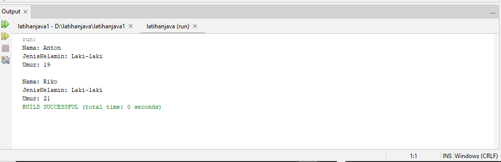
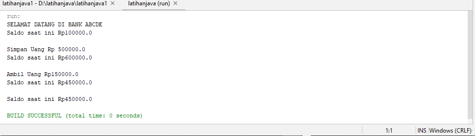

# latihan1

• Mendeklarasikan class Person, dengan atribut Nama,
JenisKelamin, Umur
```java
public class person {

    String Nama;
    String JenisKelamin;
    Integer Umur;
}
```
• Buatlah dua buah objek dari class Person bernama Anton
dan Riko
```java
public class personGo {

    public static void main(String[] args) {
        person Anton = new person();
        person Riko = new person();

        Anton.Nama = "Anton";
        Anton.JenisKelamin = "Laki-laki";
        Anton.Umur = 19;

        Riko.Nama = "Riko";
        Riko.JenisKelamin = "Laki-laki";
        Riko.Umur = 21;

        System.out.println("Nama: " + Anton.Nama);
        System.out.println("JenisKelamin: " + Anton.JenisKelamin);
        System.out.println("Umur: " + Anton.Umur);
        System.out.println("\nNama: " + Riko.Nama);
        System.out.println("JenisKelamin: " + Riko.JenisKelamin);
        System.out.println("Umur: " + Riko.Umur);
    }
}
```
• Hasil Run


---

# latihan2
• Mendeklarasikan class AkunBank dengan instance method
simpanUang, ambilUang dan cekSaldo
```java
public class AkunBank {

    double saldo;

    AkunBank(double S) {
        this.saldo = S;
        System.out.println("SELAMAT DATANG DI BANK ABCDE");
    }

    void cekSaldo() {
        System.out.println("Saldo saat ini Rp" + saldo + "\n");
    }

    void SimpanUang(double S) {
        this.saldo += S;
        System.out.println("Simpan Uang Rp " + S);
        this.cekSaldo();
    }

    void AmbilUang(double S) {
        if (this.saldo - S >= 0) {
            this.saldo -= S;
            System.out.println("Ambil Uang Rp" + S);
        } else {
            System.out.println("Saldo tidak mencukupi");
        }
        this.cekSaldo();
    }
}
```
• Buat objek AkunBank dan tetapkan nilai saldo awal Rp. 100000,
kemudian panggil 3 method tersebut
```java
public class BankGo {

    public static void main(String[] args) {
        AkunBank rekening = new AkunBank(100000);
        rekening.cekSaldo();
        rekening.SimpanUang(500000);
        rekening.AmbilUang(150000);
        rekening.cekSaldo();
    }
}
```
• Hasil Run

